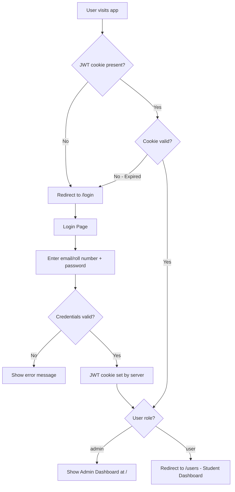
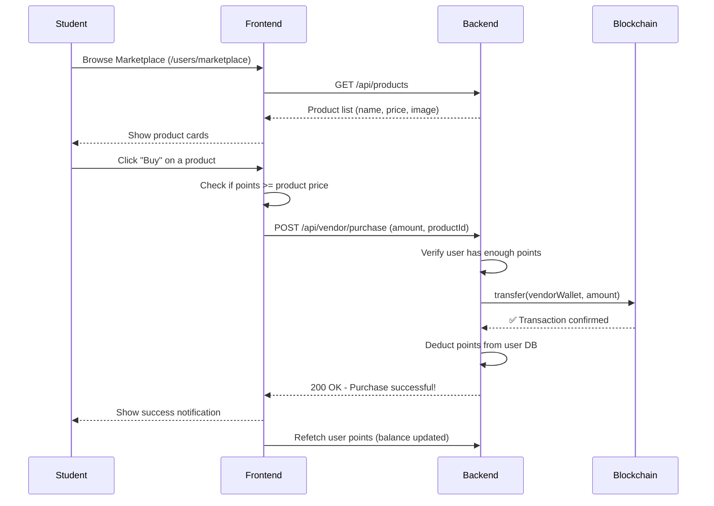
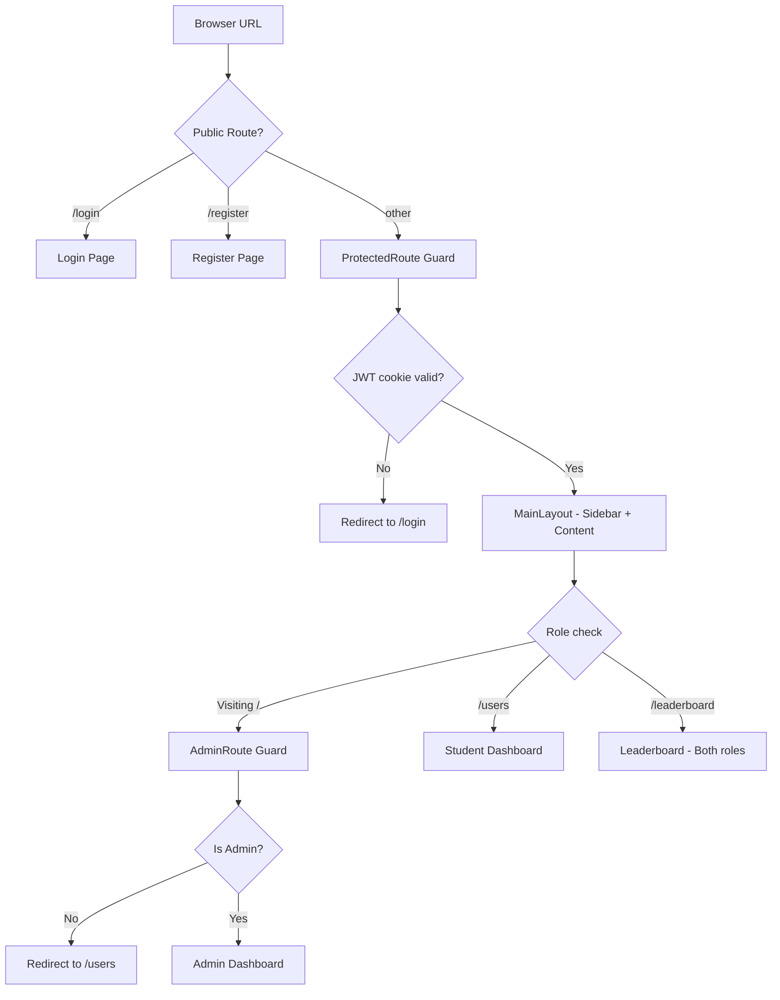

# 🌿 GreenCoin Frontend

> A React-based web dashboard for the Smart Waste Management System — supports two different user experiences: one for **students** and one for **admins**, all built with Vite + React 19.

---

## 📖 Table of Contents

- [What Does the Frontend Do?](#what-does-the-frontend-do)
- [Tech Stack](#tech-stack)
- [Project Structure](#project-structure)
- [Pages & Features](#pages--features)
- [User Flows](#user-flows)
  - [Authentication Flow](#authentication-flow)
  - [Student Dashboard Flow](#student-dashboard-flow)
  - [Admin Dashboard Flow](#admin-dashboard-flow)
  - [Marketplace Flow](#marketplace-flow)
- [Routing Architecture](#routing-architecture)
- [Running Locally](#running-locally)

---

## What Does the Frontend Do?

The frontend is a **single-page application (SPA)** that serves two completely different types of users:

```
┌─────────────────────────────────────────────────────────┐
│                    GreenCoin Web App                     │
├─────────────────────────┬───────────────────────────────┤
│      👨‍🎓 STUDENT VIEW      │       👩‍💼 ADMIN VIEW           │
├─────────────────────────┼───────────────────────────────┤
│ • Personal Dashboard    │ • System-wide Analytics       │
│ • Waste History + Chart │ • User Management             │
│ • Marketplace (buy)     │ • Bin Monitoring              │
│ • My Orders             │ • Product Management          │
│ • Transaction History   │ • Transaction History         │
│ • Profile & Wallet      │ • Leaderboard                 │
│ • Leaderboard           │ • Security Notifications      │
└─────────────────────────┴───────────────────────────────┘
```

---

## Tech Stack

| Tool | Purpose |
|------|---------|
| **React 19** | UI component framework |
| **Vite 8** | Lightning-fast development server & bundler |
| **React Router v7** | Client-side navigation (SPA routing) |
| **TanStack Query v5** | Data fetching, caching, and synchronization |
| **Axios** | HTTP requests to the backend |
| **Recharts** | Beautiful charts for waste analytics |
| **ethers.js v6** | Connect to MetaMask for blockchain wallet |
| **Lucide React** | Clean, modern icon library |
| **Sass** | Enhanced CSS with variables and nesting |

---

## Project Structure

```
green-coin-frontend/
├── index.html                  ← App entry HTML
├── vite.config.js              ← Vite configuration
├── src/
│   ├── main.jsx                ← React root, QueryClient setup
│   ├── App.jsx                 ← Router provider
│   ├── App.routes.jsx          ← All page routes defined here
│   │
│   ├── features/              ← Feature-based organization
│   │   ├── Auth/              ← Login + Register
│   │   │   ├── pages/
│   │   │   │   ├── Login.jsx
│   │   │   │   └── Register.jsx
│   │   │   ├── components/    ← Form components
│   │   │   ├── hooks/         ← useLogin, useRegister custom hooks
│   │   │   ├── services/      ← API calls for auth
│   │   │   └── style/
│   │   │
│   │   ├── Admin/             ← Admin-only features
│   │   │   ├── Pages/
│   │   │   │   ├── DashboardAdmin.jsx
│   │   │   │   ├── UserManagement.jsx
│   │   │   │   ├── UserDetails.jsx
│   │   │   │   ├── BinPages.jsx
│   │   │   │   ├── Marketplace.jsx
│   │   │   │   ├── LeaderBoard.jsx
│   │   │   │   └── TransactionHistoryAdmin.jsx
│   │   │   ├── components/    ← BinCard, StudentCard, etc.
│   │   │   ├── hooks/         ← Data fetching hooks
│   │   │   └── services/      ← Admin API calls
│   │   │
│   │   └── User/              ← Student features
│   │       ├── pages/
│   │       │   ├── Dashboard.jsx
│   │       │   ├── Profile.jsx
│   │       │   ├── Marketplace.jsx
│   │       │   ├── MyOrders.jsx
│   │       │   └── TransactionHistory.jsx
│   │       ├── hooks/
│   │       └── services/
│   │
│   ├── global/               ← Shared utilities
│   │   └── utils/
│   │       ├── ProtectedRoute.jsx  ← Redirect to login if not authenticated
│   │       └── AdminRoutes.jsx     ← Redirect to /users if not admin
│   │
│   └── layout/
│       └── Mainlayout.jsx    ← Shared sidebar/header shell
```

---

## Pages & Features

### Admin Pages

| Page | Path | What It Does |
|------|------|-------------|
| **Admin Dashboard** | `/` | Analytics charts, total waste stats, quick overview |
| **User Management** | `/user-management` | Browse all students, assign RFID cards |
| **User Details** | `/user-management/:id` | Individual student's waste history chart |
| **Bin Monitoring** | `/bin` | View all dustbins and their current fill levels |
| **Marketplace** | `/marketplace` | Add/remove reward products |
| **Transactions** | `/transactions` | Full blockchain transaction log |
| **Leaderboard** | `/leaderboard` | Top students by points |

### Student Pages

| Page | Path | What It Does |
|------|------|-------------|
| **Student Dashboard** | `/users` | Personal stats, points, daily waste chart |
| **Marketplace** | `/users/marketplace` | Browse & buy products with GreenCoin |
| **Profile** | `/users/profile` | View profile, connect MetaMask wallet |
| **My Orders** | `/users/orders` | Purchase history |
| **Transactions** | `/users/transactions` | GreenCoin token transaction history |

### Auth Pages

| Page | Path | What It Does |
|------|------|-------------|
| **Login** | `/login` | Sign in with email or roll number |
| **Register** | `/register` | Create a new student account |

---

## User Flows

### Authentication Flow



**Key Design Decision:** The server sets the JWT as an **httpOnly cookie**. This means JavaScript cannot access it directly — making it much harder for hackers to steal the token. The browser automatically sends it with every request.

---

## Student Dashboard Flow

### 1. Student Login
- Student logs in  
- Redirected to **Student Dashboard (`/users`)**

---

### 2. Dashboard Overview
- Fetches:
  - User profile and points  
  - Waste chart (last 7 days)  
  - Leaderboard ranking  

- Displays:
  - Points balance  
  - Daily waste summary  
  - Leaderboard position  
  - Bar chart of daily waste (in grams)  

---

### 3. Navigation Modules

#### A. Marketplace (`/users/marketplace`)
- Browse available products  
- Select a product to purchase  

- Purchase Flow:
  - Check if user has enough points  
    - If **No** → Show "Insufficient points" message  
    - If **Yes** → Confirm purchase  
  - Backend processes:
    - Blockchain transfer  
    - Database deduction  
  - Result:
    - Points deducted  
    - Order saved  

---

#### B. Profile (`/users/profile`)
- View profile details  

- Wallet Connection:
  - If wallet **not connected**:
    - Show **Connect MetaMask** button  
    - Open MetaMask popup  
    - Save wallet address to profile  

  - If wallet **already connected**:
    - Display wallet address  
    - Show Green Coin (GC) balance  

---

### 4. Summary Flow
Student → Dashboard → View Stats → Navigate (Marketplace / Profile) → Perform Actions

## Admin Dashboard Flow

### 1. Admin Login
- Admin logs in  
- Redirected to **Admin Dashboard (`/`)**

---

### 2. Dashboard Overview
- Displays:
  - Total waste weight (all time)
  - Waste collection chart (last 7 days)
  - Notifications / security alerts  

---

### 3. Navigation Modules

#### A. User Management (`/user-management`)
- View all students:
  - Roll numbers  
  - Points  
  - RFID UID status  

- Click on a student:
  - View individual waste chart  
  - Assign RFID UID  
  - Promote to admin  
  - Delete account  

---

#### B. Dustbin Monitor (`/bin`)
- View all bins:
  - Bin name  
  - Capacity  
  - Current fill level  

- Includes:
  - Visual fill percentage indicator  

---

#### C. Marketplace (`/marketplace`)
- View all products  
- Add new product:
  - Image  
  - Price (in points)  

- Delete existing products  

---

#### D. Transactions (`/transactions`)
- View transaction logs  
- Filter by:
  - Reward transactions  
  - Purchase transactions  

- Details include:
  - Transaction hash  
  - Wallet address  
  - Amount  
  - Status  

---

### 4. Summary Flow
Admin → Dashboard → Select Module → Perform Actions (User / Bin / Marketplace / Transactions)

### Marketplace Flow



---

## Routing Architecture

The app uses **React Router v7** with a nested route structure:



**Two Route Guards:**

1. **`ProtectedRoute`** — Anyone not logged in gets sent to `/login`
2. **`AdminRoute`** — Any non-admin trying to access admin pages gets sent to `/users`

This ensures students **cannot** accidentally access admin management pages.

---

## Running Locally

### Prerequisites
- Node.js 18+
- Backend server running at `http://localhost:3000`

### Steps

```bash
# 1. Navigate to the frontend directory
cd green-coin-frontend

# 2. Install all dependencies
npm install

# 3. Start the development server
npm run dev
```

The app opens at **http://localhost:5173**

### Building for Production

```bash
npm run build
```

This creates an optimized `dist/` folder ready to deploy to Vercel, Netlify, or any static host.

> 💡 **Tip:** Make sure the backend is running before starting the frontend, or API calls will fail.
